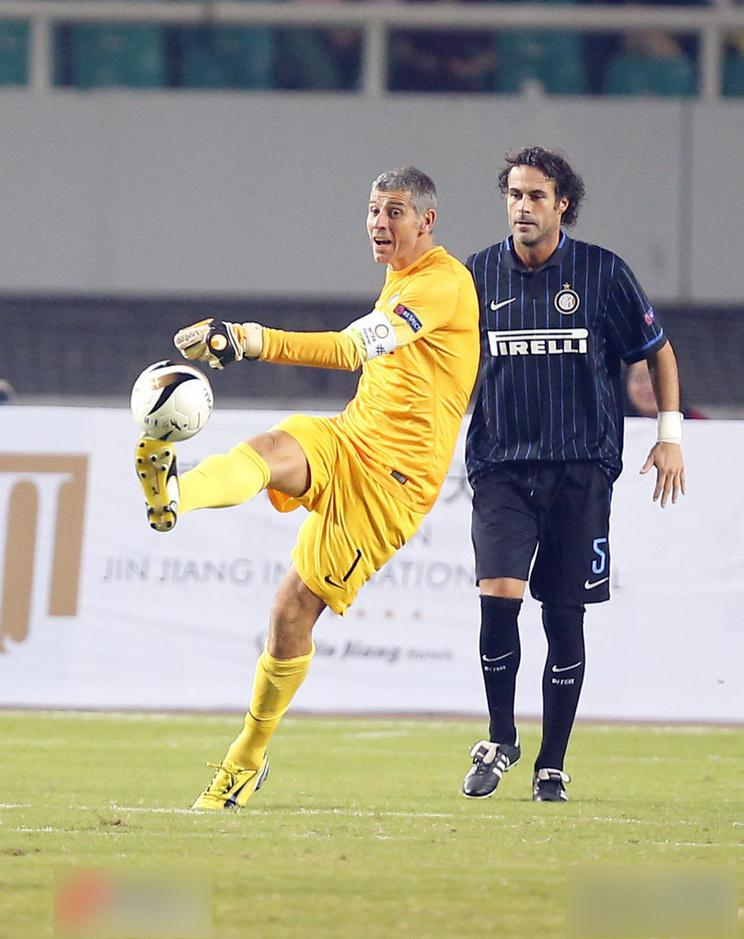

# AIC-Pose
## Updates

* Experimenting 

## Dataset and Training

The Dataset is provided by AI Challenger. Some examples:

</img>
</img>

## Baseline
There is a baseline implementation:
[AI_Challenger](https://github.com/AIChallenger/AI_Challenger)